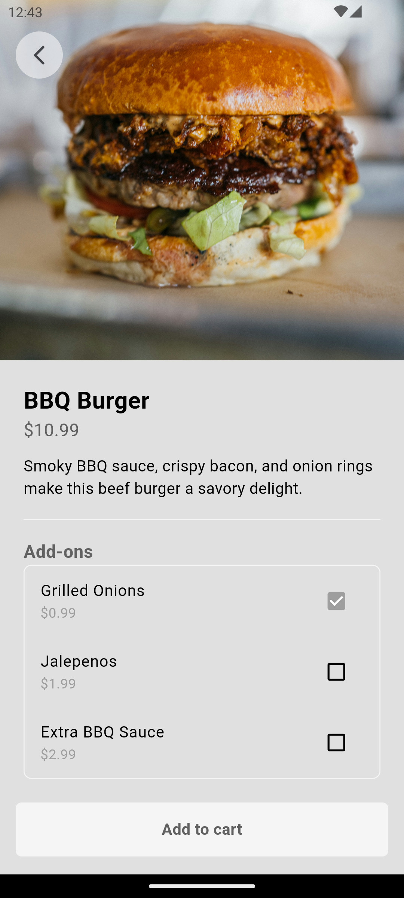

# Food App

A simple `food delivery app`. Contains only UI without any backend.

- ### Login UI

    

- ### HomeScreen UI

    

- ### Food Description UI

    

- ### Cart UI

    

- ### Checkout UI

    

- ### Receipt UI

    

